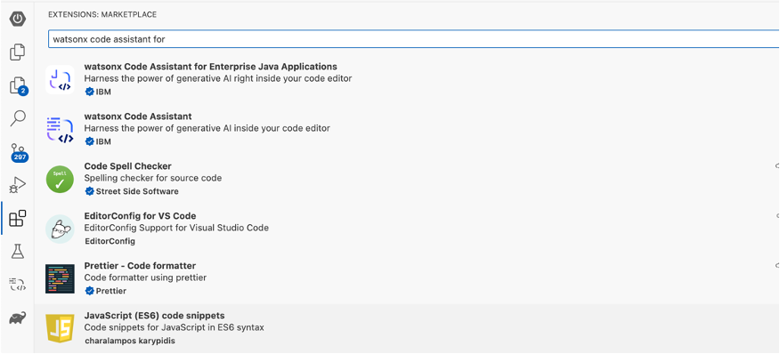
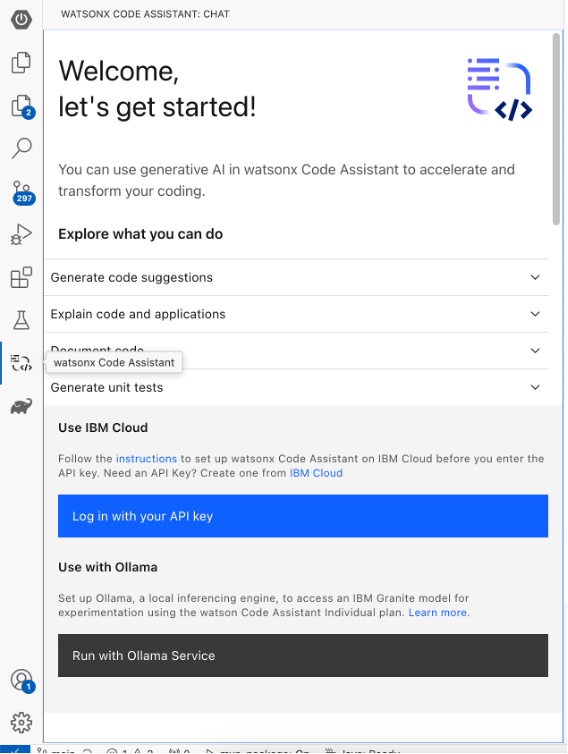
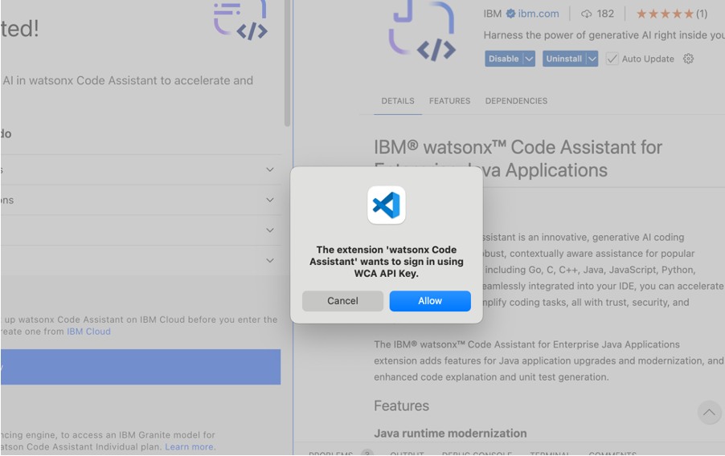

# Installation guide for WCA on VSCode

이 문서는 **Watson Code Assistant For Enterprise Java (WCA4EJ)**를 실행하는 데 필요한 소프트웨어 도구를 IDE VSCode에 설치하는 방법에 대한 정보를 제공합니다.

Last updated: Dec 2nd, 2024

## Environment setup 

### 1. Java installation

#### Install Java21 using this link:
- [Download Java for MacOS - Arm64](https://download.oracle.com/java/21/latest/jdk-21_macos-aarch64_bin.tar.gz)
- [Download Java for MacOS - x86](https://download.oracle.com/java/21/latest/jdk-21_macos-x64_bin.tar.gz)
- [Download Java for Windows](https://download.oracle.com/java/21/latest/jdk-21_windows-x64_bin.zip)

로컬에 위의 압축파을일 다운 받아 추출하세요.

- 자바 설치가 잘 되었는지 아래 명령어를 통해 확인 하세요:
```bash
java --version
```

- 자바 설치가 끝나면, `PATH` 변수에 java를 추가하고 `JAVA_HOME` 환경 변수를 설정해 주세요.
- **For Mac**:
  - .zshrc 혹은 .bash_profile 열어주세요.
      ```bash
      nano ~/.zshrc
      ```
  - 아래 코드를 추가 해주세요.
      ```bash
      export JAVA_HOME=/Library/Java/JavaVirtualMachines/<java version>/Contents/Home
      ```
      ```bash
      export PATH=$JAVA_HOME/bin:$PATH
      ```
  - 파일을 저장하고 나와 주세요. (press CTRL + X, then Y, and hit Enter)
  - 수정한 내용이 반영 될 수 있도록 shell configuration 재시작 해 주세요.
      ```bash
      source ~/.zshrc
      ```
  - 아래 커맨드로 JAVA_HOME을 확인 해 주세요:
      ```bash
      echo $JAVA_HOME
      ```
- **For Windows**:
  - 환경 변수 설정 사항을 검색바를 통해 쳘어 주세요.("환경 병수 편집" 을 검색에서 찾아 주세요)
  
  

  - 환경변수를 이용하여 JAVA_HOME을 설정하고 (JAVA_HOME 환경변수가 없으면 new를 클릭하여 새로 생성하고, 있다면 JAVA_HOME을 수정해 주세요), 앞 스텝에서 설치한 java path를 값으로 넣어 줍니다.:
    
  

    ```bash
    JAVA_HOME= C:\Program Files\Java\jdk-21
    ```
    
  - 환경 변수를 이용하여 PATH에 JAVA를 추가합니다.:
 
  
 
    ```bash
    %JAVA_HOME%\bin
    ```


### 2. Install Maven

- **For Windows**
    - 공식 Maven website를 방문하세요: [Maven Download Page](https://maven.apache.org/download.cgi)
    - "Files"아래 , binary zip archive link를 클릭 해 주세요(e.g., apache-maven-x.x.x-bin.zip). 
    - zip 파일을 원하는 위치에 압축 해제하세요., e.g., C:\Apache\maven.
    - 환경변수를 이용하여 MAVEN_HOME 을 설정해 주세요:
      ```bash
      MAVEN_HOME= <path-to-folder>\maven\apache-maven-3.9.9-bin\apache-maven-3.9.9
      ```
    - 환경변수에서 PATH에 Maven 을 추가해 주세요.: 
      ```bash
      <path-to-folder>\maven\apache-maven-3.9.9-bin\apache-maven-3.9.9\bin
      ```
- **For Mac**
   - homebrew를 이용하여 maven을 설치해 주세요
      ```bash
      brew install maven
      ```
   - maven이 제대로 설치 되었는지 확인 해 주세요:
      ```bash
      mvn --version
      ```


### 3. Install VSCode

- VScode를 설치 해 주세요. [VSCode Official Website](https://code.visualstudio.com/download)


### 4. WCA4EJ API Key

현재로서는 API 키는 IBM 직원들이 제공합니다. 이에 대한 도움이 필요하시면 IBM 직원들에게 문의해 주세요.


### 5. Installing Wca4ej extension

VSCode Extension에서 watsonx Code Assistant for Enterprise Java Applications 을 설치 해 주세요: 



#### **Step 5** 를 마치시고 나서

- VScode의 왼쪽에 watsonx code assistant 를 선택하고 **Login with your API key**를 선택 해주세요. 



- 팝업창이 나타나면 **Allow**를 선택합니다.



- 만약 다음과 같은 경고를 확인 하면  **"administrator needs to associate you with a deployment space"**, IBM 직원에게 문의 해 주세요. 


### 6. Installing Liberty Tools and Java Extension

아래와 같이 VSCode 마켓플레이스에서 Liberty Tools 및 Java 확장 팩을 설치하세요.


### 7. Start Using WCA4EJ

**watsonx Code Assistant**  탭으로 이동하여 WCA4EJ의 채팅 창을 열고 모델과 대화함으로써 API 키가 올바르게 설정되었는지 확인할 수 있습니다.


