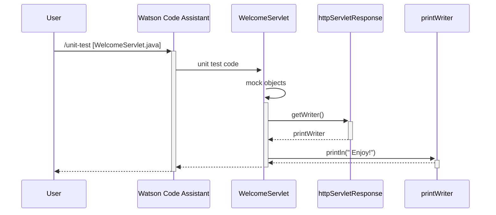

```mermaid
sequenceDiagram
    participant User as User
    participant WCA as Watson Code Assistant
    participant WelcomeServlet as WelcomeServlet
    User->>+WCA: /unit-test [WelcomeServlet.java]
    WCA->>+WelcomeServlet: unit test code
    WelcomeServlet->>+WelcomeServlet: mock objects
    WelcomeServlet->>+httpServletResponse: getWriter()
    httpServletResponse-->>-WelcomeServlet: printWriter
    WelcomeServlet->>+printWriter: println(" Enjoy!")
    printWriter-->>-WelcomeServlet: 
    WelcomeServlet-->>-WCA: 
    WCA-->>-User: 
```